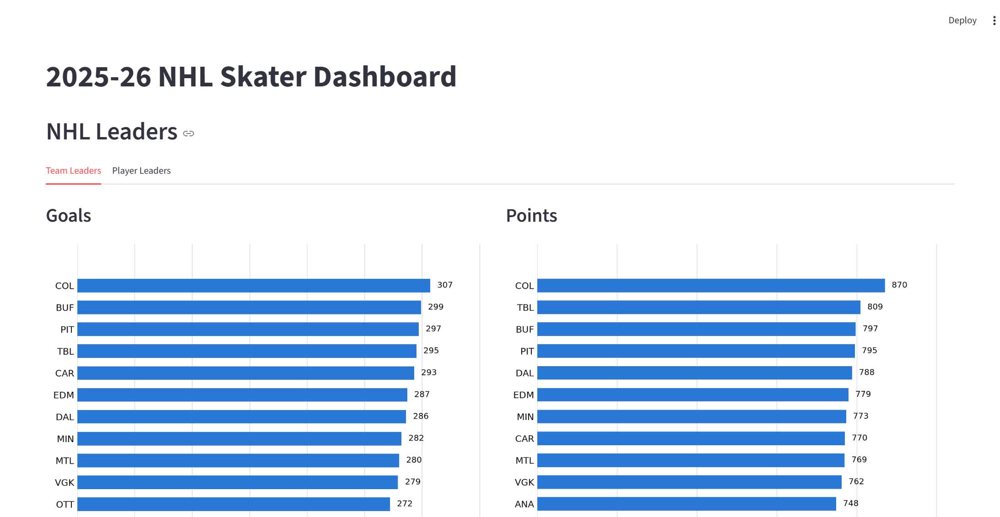
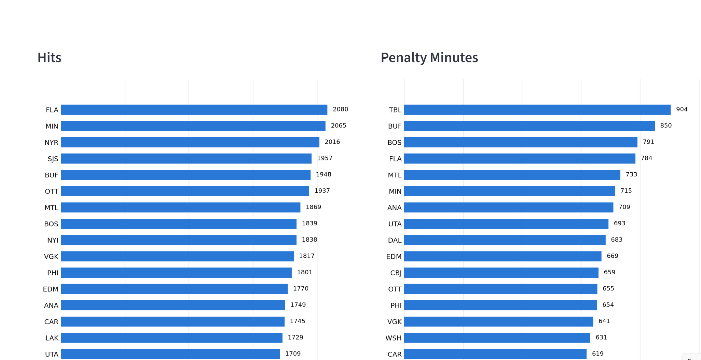
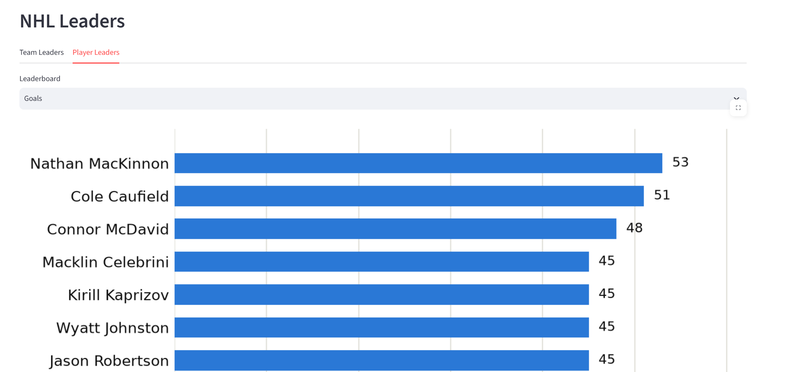
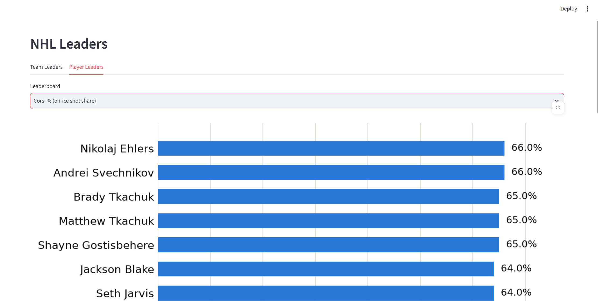
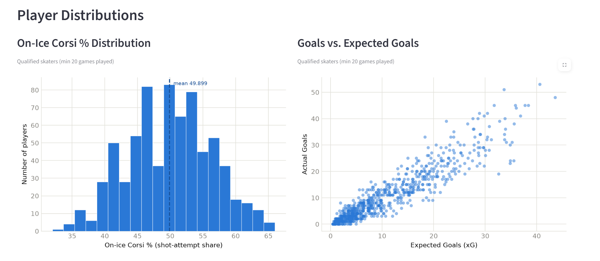

# DTSC 3601 HW1

A Streamlit dashboard exploring 2025-26 NHL skater stats (goals, points, hits,
penalty minutes, Corsi % (share of total shot attempts, for and against, while a
player is on the ice — a proxy for puck possession and territorial play), and
goals vs. expected goals).

## Run it

```bash
uv sync
uv run streamlit run app.py
```

## Screenshots

### Team Leaders — Goals & Points


### Team Leaders — Hits & Penalty Minutes


### Player Leaders — Goals


### Player Leaders — Corsi %


### Player Distributions

